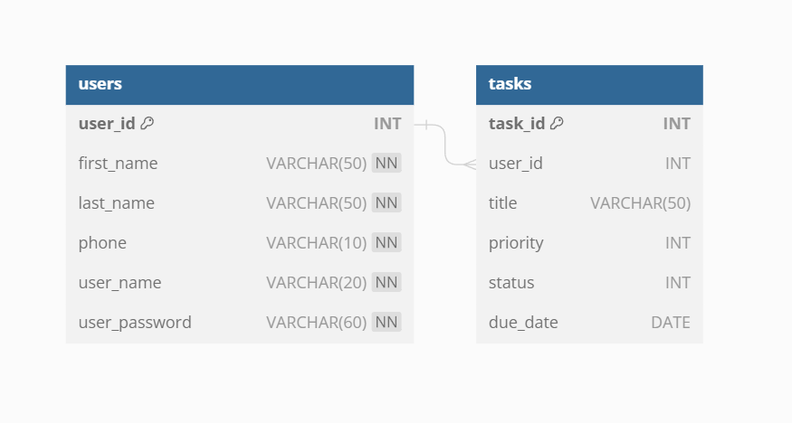

# Database
## Environment variable (For Docker)
หากต้องการ run Database ผ่าน Docker image ***zhunismp/todo_app_db*** ที่ผมได้เตรียมไว้ให้ ภายในตัว Database จะมี environment ดังนี้
- ENV MYSQL_ROOT_PASSWORD = password
- ENV MYSQL_DATABASE = todo_db
- ENV MYSQL_USER = admin
- ENV MYSQL_PASSWORD = password

หากทำการ run Database ด้วย image ***zhunismp/todo_app_db*** ให้ทำการนำ Environment variable ไปใส่ใน .env ภายใน backend application ด้วยเพื่อให้สามารถเชื่อมต่อกับ MySQL container ได้

## Schema

ใน todo_db จะมี table อยู่ 2 table นั่นคือ **users table** และ **tasks table** 

### users table
| Field Name 	| Datatype 	| Size 	| Nullalbe 	| PK 	| Description 	|
|---	|---	|---	|---	|---	|---	|
| user_id 	| INT 	| - 	| False 	| True 	| Id of user 	|
| first_name 	| VARCHAR 	| 50 	| False 	| False 	| User's first name 	|
| last_name 	| VARCHAR 	| 50 	| False 	| False 	| User's last name  	|
| phone 	| VARCHAR 	| 10 	| False 	| False 	| User's phone number 	|
| user_name 	| VARCHAR 	| 20 	| False 	| False 	| Username to authentication 	|
| user_password 	| VARCHAR 	| 60 	| False 	| False 	| User's password stored password from bcrypt algorithm 	|

### tasks table
| Field Name 	| Datatype 	| Size  	| Nullalbe 	| PK    	| Description                                                                                   	|
|------------	|----------	|-------	|----------	|-------	|-----------------------------------------------------------------------------------------------	|
| task_id    	| INT      	| -     	| False    	| True  	| Id of task                                                                                    	|
| user_id    	| INT      	| -     	| False    	| False 	| Id of users who added task                                                                    	|
| title      	| VARCHAR  	| 50    	| False    	| False 	| Task's title                                                                                  	|
| priority   	| INT      	| [1,4] 	| False    	| False 	| Priority of task separate into 4 levels. 1 is snail, 2 is normal, 3 is urgent, 4 is emergency 	|
| status     	| INT      	| [1,3] 	| False    	| False 	| Task status 1 is todo, 2 is in progress, 3 is done                                            	|
| duedate    	| DATE     	| -     	| False    	| False 	| Deadline of task                                                                              	|
## Why RDBMS?
- เนื่องจากเป็น SQL Database เป็น Database ที่ได้รับความนิยมมาก และใช้งานง่ายเหมาะสำหรับการเริ่มต้น
- ในระยะแรกหาก application ยังมีผู้ใช้งานไม่เยอะมาก ตัวของ SQL Database ยังพอ scale ไหวแน่นอน 
- เนื่องจากผมค่อนข้างจะทำงานกับ SQL Database มากกว่าจึงเป็น preference ส่วนตัวด้วยที่เลือกใช้งาน SQL Database ซึ่งไม่ได้ขัดต่อ requirement 

> ในอนาคตหากต้องการ migrate ไปเป็น microservice architecture อาจจะต้องเปลี่ยนไปใช้งานเป็น NoSQL ซึ่งรองรับการทำ partition เพิ่มความ reliable ให้กับ application  