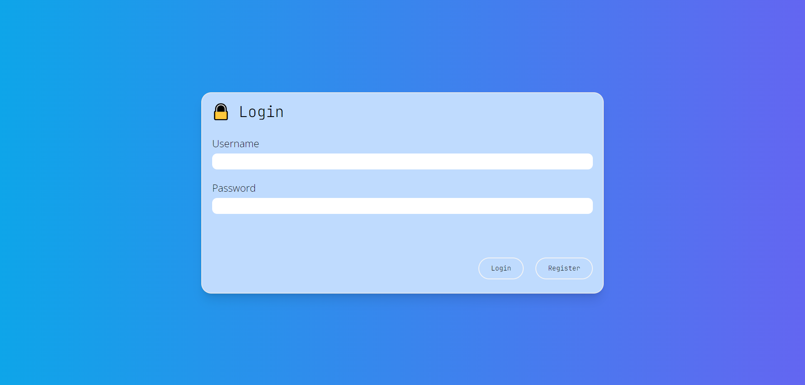
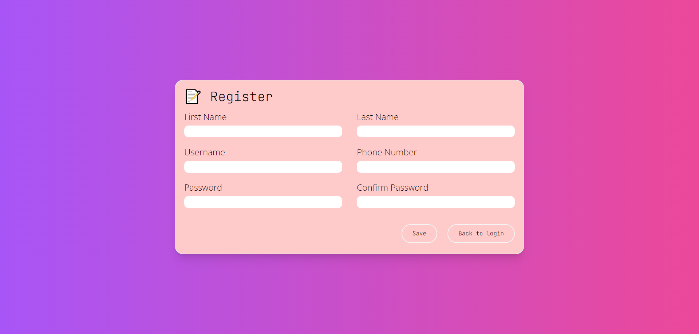
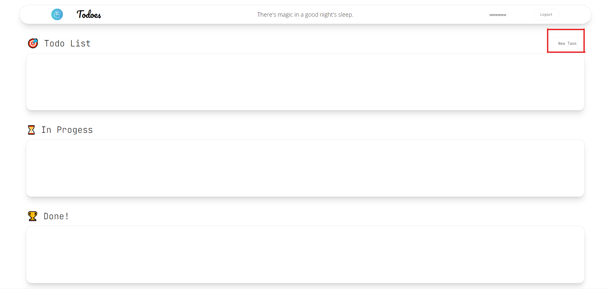
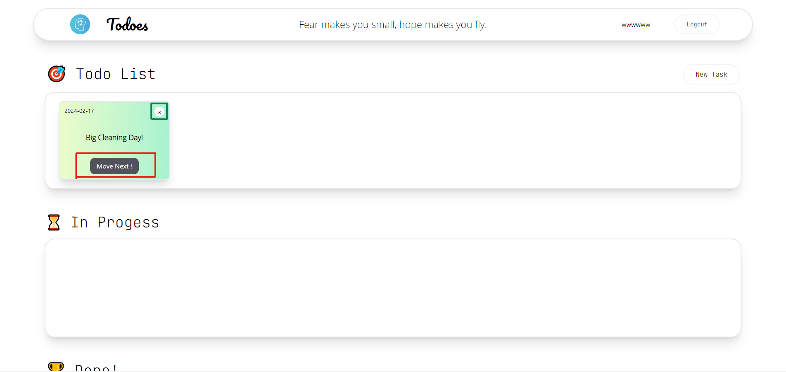
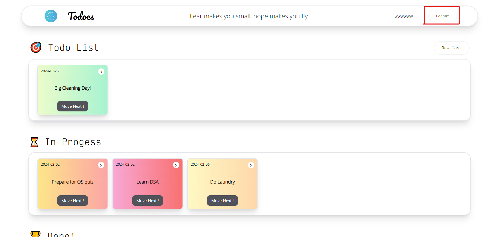

# Todo Fullstack application

Todo application เป็น web applicatoin ที่จะมาช่วยในการจดบันทึกสิ่งที่ต้องทำ และสามารถ tracking process ของงานที่ทำอยู่ได้ ตัว application จะคล้าย ๆ กับ scrum board หรือ Kanban board ที่จะแบ่งงานออกเป็น 3 ระดับนั่นคือ **_todo (ยังไม่เริ่มทำ)_**, **_inprogress (กำลังทำ)_** และ **_done (ทำเสร็จแล้ว)_**

## Table of content

1. [Project Structure](#project-structure)
2. [Tech Stack & Library](#tech-stack--library)
3. [Requirements](#requirements)
4. [How to excute project](#how-to-execute-project)
5. [Limitations](#limitations)
6. [Point to Improve](#point-to-improve)
7. [What I've learned](#what-ive-learned)
8. [Credits](#credits)

## Project Structure

ใน application นี้จะใช้ **_Model View Controller (MVC) Architecture_** ซึ่งจะแบ่ง directory ออกเป็น 3 directory หลัก ๆ ตาม MVC คือ

- **_Backend Directory_** - เป็น folder สำหรับเก็บ source code ที่ใช้ใน Backend application

- **_Database Directory_** - เป็น folder สำหรับเก็บ database script ที่ใช้ในการสร้าง database และ table ของ application

- **_Frontend Directory_** - เป็น folder สำหรับเก็บ source code ที่ใช้ใน Frontend application

ในส่วนของ Structure ของ **backendapp** และ **frontend-app** ซึ่งเป็น folder ที่มี source code ของ backend และ frontend application สามารถเข้าไปอ่านเพิ่มเติมได้ใน _README_ ที่อยู่ภายใน Directory นั้นได้เลยครับ

## Tech Stack & Library

- Frontend
  - React
  - React-query
  - React-router
  - Tailwind CSS
- Backend
  - Springboot 3 (+ Spring security)
  - Spring JPA
  - MySQL

## Requirements

1. Java version >= 17
2. Node version >= 18
3. มี Tools ที่ใช้ในการ host Database เช่น MySQL workbench หรือ docker สำหรับ run Database container

## How to execute project

1.  Initialize Database ซึ่งสามารถทำได้ทั้งแบบ 1.1 และ 1.2 ขึ้นอยู่กับ preference ของผู้ใช้

    1.1 Local Database โดยนำ app_db.sql ไปทำการ execute ใน RDMBS software เช่น MySQL เพื่อสร้างฐานข้อมูลสำหรับใช้ใน application

    1.2 ใช้ Docker ในการสร้าง container สำหรับ database โดยสามารถสร้างจาก
    image ที่ผมแปะไว้บน docker hub ได้เลยครับ

    ```
    docker run --rm --name db -p 3307:3306 zhunismp/todo_app_db
    ```

2.  หลังจาก database พร้อมใช้งานแล้วให้ทำการเปิด terminal ขึ้นมาแล้วให้ทำการสร้าง .env ไฟล์ใน folder เดียวกับ application.properties โดยใน .env จะต้องมี content ตามนี้เป็นอย่างน้อย (SQL_USERNAME, SQL_PASSWORD ต้องตรงตามที่ Database ใช้เท่านั้น)

    ```
    # URL for database
    SQL_DATABASE="jdbc:mysql://localhost:3307/todo_db"

    # Username for access database must match with uesrname in database
    SQL_USERNAME="root"

    # Password for access database (must match with password in database)
    SQL_PASSWORD="password"

    # Secret for manage and authentication (enter your own secret.)
    JWT_SECRET=""

    # Frontend URL (Depends on your frontend port)
    FRONTEND_ORIGIN="http://localhost:3000"
    ```

3.  หลังจากที่เพิ่ม .env file ไปเรียบร้อยแล้วให้ทำการ cd เข้าไปใน folder backendapp แล้วทำการ run ได้เลย
4.  หลังจากนั้นให้ cd เข้าไปใน folder Frontend/frontend-app แล้วทำการ run คำสั่งต่อไปนี้

    ```
    # step 1
    npm install

    # step 2
    npm start

    ```

    > ในตอนนี้ยังติดปัญหาเรื่องการ containerize ตัว Backeกd จึงทำให้ยังไม่สารมารถ run แบบ container ได้ทั้ง application

## Application Mannual

1. เมื่อเข้ามาที่ port ของ frontend application แล้วจะเจอกับหน้า login แบบนี้ หากได้ทำการ register ไว้แล้วก็สามารถ Login เพื่อเข้าใช้งานได้เลย หากยังไม่ได้ register สามารถกดปุ่ม Register เพื่อไปยังหน้า register ได้
   
2. ภายในหน้า Register **_ให้ทำการกรอกข้อมูลให้ครบทุกช่อง_** โดยที่
   
   - **Username** จะต้องอยู่ระหว่าง 6-20 ตัวอักษร และห้ามมีช่องว่าง
   - **Phone** จะต้องประกอบไปด้วยตัวเลข 10 ตัวเท่านั้น ห้ามเป็นตัวอักษร
   - **Password** จะต้องมีความยาวตั้งแต่ 8 ตัวขึ้นไป และต้องประกอบด้วย ตัวอักษรอย่างน้อย 1 ตัวขึ้นไป, ตัวเลขอย่างน้อย 1 ตัวขึ้นไป และตัวอักษรพิเศษอย่างน้อย 1 ตัวขึ้นไป และห้ามมีช่องว่าง
3. หลังจากที่ทำการ register และ login เข้ามาแล้วก็จะเจอกับหน้าหลักของ application
   
   ซึ่งหากต้องการเพิ่ม Task ที่ต้องทำสามารถกดที่ Add Task Button เพื่อทำการเปิด modal ขึ้นมาสำหรับสร้าง Task ใหม่
   4.ให้ทำการกรอกข้อมูลของ Task ที่ต้องการจะเพิ่มลงไปแล้วทำการกด Save Button เพื่อบันทึกข้อมูล หากไม่ต้องการทำรายการให้กดที่ Cancel Button
   > Due date หรือ Deadline จะต้องไม่เป็นวันที่ผ่านมาแล้ว
4. เมื่อกด Save แล้ว Task จะมาอยู่ใน state Todo และหาก Task มี progression สามารถกดปุ่ม move next เพื่อย้ายไปยัง state ถัดไปได้ หรือหากจะยกเลิก Task นี้สามารถกดปุ่ม X ได้ที่มุมบนขวาของ Task card
    - Task ใน State Done ไม่สามารถกดปุ่ม move next ได้ - **_ไม่สามารถย้อน Task ไปยัง State ก่อนหน้าได้_** เช่นไม่สามารถย้าย Task จาก Done กลับไป inprogress ได้
5. เมื่อต้องการออกจากระบบสามารถกดไปที่ Logout Button เพื่อทำการออกจากระบบได้
   

## Limitations

- ไม่รองรับ responsive view หากต้องการให้ view อยู่ในรูปแบบที่ถูกต้องจะต้องดูผ่านขนาดหน้าจอ desktop view เท่านั้น
- ยังไม่สามารถดูหรือแก้ไข profile ได้หากจะแก้ไขจำเป็นต้องสร้าง account ใหม่เท่านั้น
- หากมีการเข้า application ใหม่โดยที่ยังมี Token อยู่อาจทำให้ application ทำงานผิดพลาดได้ สามารถแก้ไขได้โดยการกด F12 แล้วไปที่ **Application >> LocalStorage** แล้วทำการ delete token ที่มีอยู่ทิ้งไป

## Point to improve

- Project structure สำหรับ frontend ยังไม่ค่อยดีทำให้คนที่ีพัฒนาต่ออาจจะใช้เวลาทำความเข้าใจนานกว่าปกติ
- ทำการ containerize application ทั้งหมดเพื่อให้สามารถใช้งานได้ง่ายขึ้นเพียงแค่ run คำสั่ง `docker-compose up`
- ในส่วนของ Architecture อาจจะ migraite ไปใช้ Microservice Architecture เพื่อเพิ่มความ reliable ของ application ได้
- ควรจะมีการเพิ่มการ logging เข้ามาเพื่อสามารถ analyze เวลาที่ application เกิดปัญหาได้ง่ายขึ้น

## What I've learned

- ได้เรีนรู้เกี่ยวกับการทำ Authentication system (+ JWT) ด้วย Spring security
- เรียนรู้เกี่ยวกับ CORS เพื่อทำความเข้าใจ และสามารถเชื่อมต่อระหว่าง Backend และ Frontend ได้
- การใช้ React-query เพื่อช่วยลด code จากการใช้ useEffect และ manage state ได้ดียิ่งขึ้น
- การ protected endpoint ด้วย React-router

## Credits

- [Spring security 6 with JWT](https://www.youtube.com/watch?v=YERACEd-VSw&t=970s)
- [React router](https://www.youtube.com/watch?v=X8eAbu1RWZ4&list=PLC3y8-rFHvwjkxt8TOteFdT_YmzwpBlrG&index=15)
- [React-query](https://www.youtube.com/watch?v=6Bgbq6xRBwU&t=1092s)
